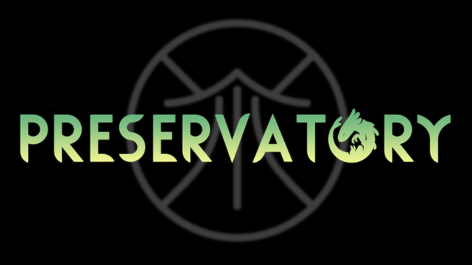

# Preservatory


## Downloading
If you own the game on Steam, you can download the mod through the [Steam Workshop](https://steamcommunity.com/sharedfiles/filedetails/?id=3357751340). If you do not own the game on Steam, you can download it through [RainDB](https://www.raindb.net/), or follow the instructions below to install it through this GitHub repository:

1. Click the green "Code" button, then "Download ZIP"
2. The mod files are located in the folder named "Preservatory". Drag and drop this folder into \<your Rain World installation\>/RainWorld_Data/StreamingAssets/mods
3. You have now installed the mod. To uninstall it, delete the folder.

## Development
> [!WARNING]
> This section contains major spoilers for the mod. Do not read further if you have not played!

### Creating a custom ending
In order to create a custom stasis ending for your slugcat, you will need both level editing and code, and there are requirements for both.

#### Level editing requirements
- You will need to create the dream room(s) that your slugcat will be warped to upon touching the light in the stasis chamber.
  - They need to exist in the Preservatory region, so they must begin with `PV_`.
  - If you want to be more accurate to the naming convention, have it begin with `PV_DREAM_` followed by some identifier for your slugcat.
  - At least one of your rooms must have a PVTeleporter dev tools object set to "endDream" in the area where the dream will end. This is a requirement to prevent becoming softlocked in the dream rooms.
  - If your slugcat needs to change the cutscene end stasis chamber room (like Hunter does), you need to create this as well.
    - The level editor files for PV_END (the regular version used by all non-Hunter slugcats) and all tiles and props it uses can be found on [Solar's repo](https://github.com/solaristheworstcatever/Modded-Regions-Starter-Pack/tree/main/LevelEditorProjects/Regions/Preservatory)
- Put your dream rooms in \<your mod\>/world/pv-rooms
- Enter your rooms with Downpour's modify file syntax in \<your mod\>/modify/world/pv/world_pv.txt, with any connections not between your dream rooms set to DISCONNECTED
  - Note that all rooms MUST have at least one entrance in order for Rain World to be able to load them without crashing
  - Here is an example:
    ```
    [MERGE]
    ROOMS
    // Dream rooms
    PV_DREAM_EXAMPLE01 : DISCONNECTED, PV_DREAM_EXAMPLE02
    PV_DREAM_EXAMPLE02 : PV_DREAM_EXAMPLE01

    // Ending room, if you happen to have one
    PV_END_EXAMPLE : DISCONNECTED
    END ROOMS
    [ENDMERGE]
    ```

#### Code stuff requirements
In order to only make Preservatory a soft dependency, extra precautions will be necessary. I will outline how to go about this so that Preservatory will be optional, and that users will not crash if they do not have Preservatory installed.

1. Make sure to reference Preservatory's .dll file in your code project!
2. Make Preservatory a `BepInDependency`
  - Above your BepInPlugin line, put this line:
    ```cs
    [BepInDependency("lb-fgf-m4r-ik.pv-lab-stuff", BepInDependency.DependencyFlags.SoftDependency)]
    ```
3. Set up the registration code
  - Create a static class, and name it something you'll remember, like `PVEnding`
  - Within it, create a static method called `Apply`
  - Your PVEnding class should look like this:
    ```cs
    public static class PVEnding
    {
        public static void Apply()
        {
            // Menu art scene id
            var slugcat = new SlugcatStats.Name("your slugcat id here", false);
            PVMaps.nameSceneMap.Add(slugcat, "Your_Menu_Art_Scene_ID");
            PVMaps.dreamRoom.Add(slugcat, new StaticStuff.Destination()
            {
                roomName = "PV_DREAM_EXAMPLE01",
                position = new Vector2(123f, 456f) // replace with precise coordinates in the room to spawn, use dev tools + M
            });
            
            // Ending room, if you happen to have one
            PVMaps.endRoom.Add(slugcat, "PV_END_EXAMPLE");
        }
    }
    ```
4. Make the code only register stuff if Preservatory is enabled (prevents crashes)
  - Put this code in an `OnModsInit` hook:
    ```cs
    if (ModManager.ActiveMods.Exists(mod => mod.id == "preservatory"))
    {
        PVEnding.Apply();
    }
    ```
